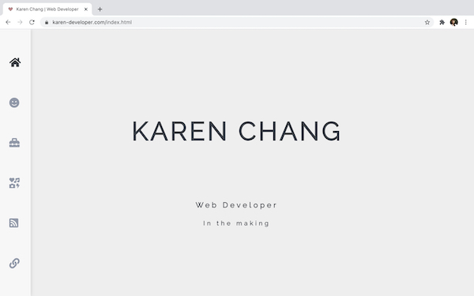
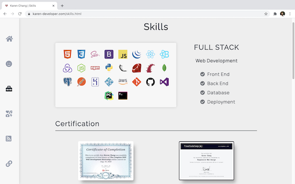
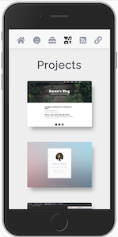
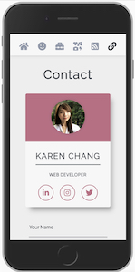

# Karen Chang's Portfolio Website

### Published link: [karen-developer.com](https://karen-developer.com/)

## Purpose
Create a portfolio website which provides information about me, my interests, skills, professional knowledge of web development and a showcase of my work.

## Target audience

An employer looking to engage a dev and/or IT professional. Expect the employer to have the following knowledge and expectations:

- technical knowledge relating to information technology, software development/coding, programming languages and development stacks
- high expectations of professionalism and a positive work ethic

## Features
1. Creative design
1. Information about myself
1. Personal skills and projects
1. Repo and social media accounts
1. Contact form

## Tech stack 
- Semantic HTML elements and attributes
- Sass/CSS
    - Flexbox
    - Grid
    - Variables
    - Mixin
- Subresource integrity (SRI) implemented
- W3S Markup/CSS validation checker passed 

## Design Concepts
- Pure CSS and no JavaScript
- Clean look
- No more than 5 colours 
- No more than 2 fonts
- More personal and less commercial

## Sitemap

## Screenshots
### Home Page - Welcome to Karen Chang's Portfolio Webiste

### About Me Page - About Myself, Achivements and Interests

### Skills Page - Learned Programming Languages, Skills and Certifications

### Projects Page - My Personal Projects

### Blog Page - My Blog Posts 

### Contact Page - My Contact Info and Message Form

