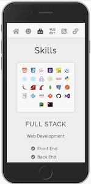
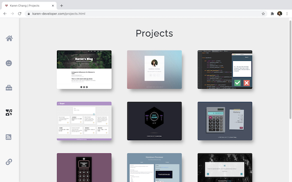

# Karen Chang's Portfolio Website

### Published link: [karen-developer.com](https://karen-developer.com/)

## Purpose
Create a portfolio website which provides information about me, my skills, interests, professional knowledge and a showcase of my work.

## Target audience
An employer looking to engage a dev and/or IT professional. Expect the employer to have the following knowledge and expectations:

- technical knowledge relating to information technology, software development/coding, programming languages and development stacks
- high expectations of professionalism and a positive work ethic

## Tech stack 
- HTML 
- Sass/CSS
    - Flexbox
    - Grid
    - Variables
    - Mixin
- Subresource integrity (SRI)  implementation 

## Features
1. Creative design
1. Information about myself
1. Personal skills and projects
1. Social media accounts
1. Contact form

## Sitemap

## Screenshots
### Home Page

### About Me Page

### Skills Page

### Projects Page

### Blog Page

### Contact Page

